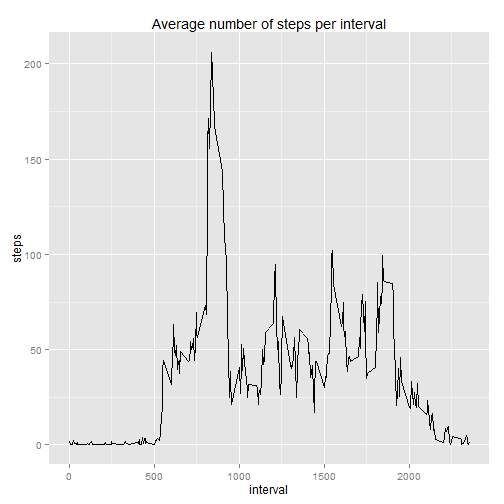

First I make sure the required libraries are installed and the LC_TIME representation is English one (that shall be necessary when dealing with weekdays()).


```r
if(!require(ggplot2)) {install(pkg="ggplot2")}
if(!require(modeest)) {install(pkg="modeest")}
suppressPackageStartupMessages(library(ggplot2))
suppressPackageStartupMessages(library(modeest))
prev.sys.lc_time <- Sys.getlocale("LC_TIME")
Sys.setlocale("LC_TIME", "English")
```

```
## [1] "English_United States.1252"
```

If missing, I download the activity.zip file by taking advantage of the URL as specified in the assignment instruction page. Then I unzip it and load it back as a csv file.
As part of the parameters of the csv reading command, I specify the expected classes for the data columns, that is a specific need for the date column.


```r
if ("activity.zip" %in% list.files() == FALSE) {
  download.file("https://d396qusza40orc.cloudfront.net/repdata%2Fdata%2Factivity.zip",
                destfile="activity.zip", method="libcurl")
}
unzip("activity.zip")
activity <- read.csv("activity.csv", header=TRUE, stringsAsFactors = FALSE, 
                     colClasses=c("numeric", "Date", "numeric"))
(d <- dim(activity))
```

```
## [1] 17568     3
```

```r
names(activity)
```

```
## [1] "steps"    "date"     "interval"
```

```r
str(activity)
```

```
## 'data.frame':	17568 obs. of  3 variables:
##  $ steps   : num  NA NA NA NA NA NA NA NA NA NA ...
##  $ date    : Date, format: "2012-10-01" "2012-10-01" ...
##  $ interval: num  0 5 10 15 20 25 30 35 40 45 ...
```

The dataset is made of 17568 rows and 3 columns. I ensure the dataset is ordered by date.


```r
date.order <- order(activity$date)
act.ord <- activity[date.order,]
head(act.ord)
```

```
##   steps       date interval
## 1    NA 2012-10-01        0
## 2    NA 2012-10-01        5
## 3    NA 2012-10-01       10
## 4    NA 2012-10-01       15
## 5    NA 2012-10-01       20
## 6    NA 2012-10-01       25
```

I compute and plot as an histogram the total number of steps taken per day. In doing that I implement two separate data aggregation procedures:

- the first uses the na.rm=false option

- the second uses the na.rm=TRUE option

Herein below I implement the first data aggregation procedure.


```r
act.sum <- aggregate(x = act.ord$steps, by = list(act.ord$date), FUN = sum, na.rm=FALSE)
colnames(act.sum) <- c("date", "steps")
head(act.sum)
```

```
##         date steps
## 1 2012-10-01    NA
## 2 2012-10-02   126
## 3 2012-10-03 11352
## 4 2012-10-04 12116
## 5 2012-10-05 13294
## 6 2012-10-06 15420
```

This is the second data aggregation procedure which removes NA values (i.e. na.rm=TRUE).


```r
act.sum.narm <- aggregate(x = act.ord$steps, by = list(act.ord$date), FUN = sum, na.rm=TRUE)
colnames(act.sum.narm) <- c("date", "steps")
head(act.sum.narm)
```

```
##         date steps
## 1 2012-10-01     0
## 2 2012-10-02   126
## 3 2012-10-03 11352
## 4 2012-10-04 12116
## 5 2012-10-05 13294
## 6 2012-10-06 15420
```

I compute the mean and median of the total number of steps taken per day. To run the mean() and median() command I have to specify anyway na.rm=TRUE to get back the result.


```r
(act.mean <- mean(act.sum$steps, na.rm=TRUE))
```

```
## [1] 10766.19
```

```r
(act.median <- median(act.sum$steps, na.rm=TRUE))
```

```
## [1] 10765
```

```r
act.mean <- round(act.mean, 0)
act.median <- round(act.median, 0)

legend1 <- paste('Mean: ', act.mean)
legend2 <- paste('Median: ', act.median)
            
ggplot(act.sum, aes(x=steps)) + 
  geom_histogram(binwidth=1000, col='black', fill="darkgreen") +
  geom_vline(aes(xintercept=act.mean), col='red') +
  geom_vline(aes(xintercept=act.median), col='violet') +
  annotate("text", x=18000, y=10, label=legend1) +
  annotate("text", x=18000, y=9, label=legend2) +
  ggtitle("Count of total number of steps (starting data includes NA)")
```

 

As shown in the plot above, the mean is equal to 1.0766 &times; 10<sup>4</sup> and median to 1.0765 &times; 10<sup>4</sup>.

Now I create the same plot using the second aggregated dataset, which uses na.rm=TRUE.


```r
(act.mean.narm <- mean(act.sum.narm$steps))
```

```
## [1] 9354.23
```

```r
(act.median.narm <- median(act.sum.narm$steps))
```

```
## [1] 10395
```

```r
act.mean.narm <- round(act.mean.narm, 0)
act.median.narm <- round(act.median.narm, 0)

legend1 <- paste('Mean: ', act.mean.narm)
legend2 <- paste('Median: ', act.median.narm)
            
ggplot(act.sum.narm, aes(x=steps)) + 
  geom_histogram(binwidth=1000, col='black', fill="darkgreen") +
  geom_vline(aes(xintercept=act.mean.narm), col='red') +
  geom_vline(aes(xintercept=act.median.narm), col='violet') +
  annotate("text", x=18000, y=10, label=legend1) +
  annotate("text", x=18000, y=9, label=legend2) +
  ggtitle("Count of total number of steps (starting data does not include NA)")
```

 

As shown in the plot above, the mean is equal to 9354 and median to 1.0395 &times; 10<sup>4</sup>

I compute the average number of steps per each time interval value averaged across all days and then I plot the results as a time-series plot.


```r
act.mean <- aggregate(x = act.ord$steps, by = list(act.ord$interval), 
                      FUN = mean, na.rm=TRUE)
colnames(act.mean) <- c("interval", "steps")
max <- which.max(act.mean$steps)
(max.interval <- act.mean[max, "interval"])
```

```
## [1] 835
```

```r
(max.value <- act.mean[max, "steps"])
```

```
## [1] 206.1698
```

```r
ggplot(act.mean, aes(x=interval, y=steps)) + geom_line() +
  ggtitle("Average number of steps per interval")
```

 

The 5-minutes interval 835 contains the maximum number of average steps, which is equal to 206.1698113


```r
(missing <- sum(is.na(act.ord$steps)))
```

```
## [1] 2304
```

In the starting dataset there are 2304 missing values. As a strategy for imputing missing values, I replace the NA values with the most frequent occurring value, which results to be zero as shown below. Afterwards, I plot the results.


```r
act.ord.rm <- act.ord[complete.cases(act.ord),]
interval.set <- unique(act.ord.rm$interval)
length(interval.set)
```

```
## [1] 288
```

```r
act.ord.na <- act.ord[!complete.cases(act.ord),]
interval.set.na <- unique(act.ord.na$interval)
length(interval.set.na)
```

```
## [1] 288
```

```r
all.equal(interval.set,interval.set.na)
```

```
## [1] TRUE
```

```r
mode <- sapply(interval.set, function(x) { mlv(subset(act.ord.rm, interval==x)$steps, method = "mfv")$M})
sum(mode == 0) == length(mode)
```

```
## [1] TRUE
```

```r
act.ord.fv <- act.ord
act.ord.fv[!complete.cases(act.ord.fv),]$steps <- 0

act.sum.fv <- aggregate(x = act.ord.fv$steps, by = list(act.ord.fv$date), 
                     FUN = sum, na.rm=FALSE)
colnames(act.sum.fv) <- c("date", "steps")

(act.mean.fv <- mean(act.sum.fv$steps))
```

```
## [1] 9354.23
```

```r
(act.median.fv <- median(act.sum.fv$steps))
```

```
## [1] 10395
```

```r
act.mean.fv <- round(act.mean.fv, 0)
act.median.fv <- round(act.median.fv, 0)

legend1 <- paste('Mean: ', act.mean.fv)
legend2 <- paste('Median: ', act.median.fv)
            
ggplot(act.sum.fv, aes(x=steps)) + 
  geom_histogram(binwidth=1000, col='black', fill="darkgreen") +
  geom_vline(aes(xintercept=act.mean.fv), col='red') +
  geom_vline(aes(xintercept=act.median.fv), col='violet') +
  annotate("text", x=18000, y=10, label=legend1) +
  annotate("text", x=18000, y=9, label=legend2) +
  ggtitle("Count of total number of steps - imputation of missing values")
```

 

As we can see above the effect of imputing the missing values have been:

1. the mean and median values have been decreased with respect the dataset analysis which comprises the NA values

2. there is a more sharp difference between the mean and median value

Moreover, as appears from the plots, the result obtained by imputing zero value in place of NA ones is the same of applying the na.rm=TRUE option to the data aggregation procedure, as ultimately verified by:


```r
all.equal(act.sum.narm, act.sum.fv)
```

```
## [1] TRUE
```

Now I introduce a new factor variable able to highlight if the day is a weekday or a weekend day. Further, I compute the mean average of steps by interval and by day type as herein below defined.


```r
act.ord.fv$daytype <- as.factor(ifelse(weekdays(act.ord.fv$date) %in% c("Saturday", "Sunday"), 
                                       "Weekend", "Weekday")) 

act.fv.mean <- aggregate(x = act.ord.fv$steps , 
                         by = list(act.ord.fv$interval, act.ord.fv$daytype), 
                         FUN = mean, na.rm=FALSE)
names(act.fv.mean) <- c("interval", "daytype", "steps")
dim(act.fv.mean)
```

```
## [1] 576   3
```

```r
act.fv.mean[0:5,]
```

```
##   interval daytype      steps
## 1        0 Weekday 2.02222222
## 2        5 Weekday 0.40000000
## 3       10 Weekday 0.15555556
## 4       15 Weekday 0.17777778
## 5       20 Weekday 0.08888889
```

```r
act.fv.mean[300:305,]
```

```
##     interval daytype  steps
## 300       55 Weekend 0.4375
## 301      100 Weekend 0.0000
## 302      105 Weekend 2.2500
## 303      110 Weekend 0.0000
## 304      115 Weekend 0.0000
## 305      120 Weekend 0.0000
```

Herein below the resulting plots.


```r
ggplot(act.fv.mean, aes(interval,steps)) + facet_grid(. ~ daytype) + geom_line() + 
  ggtitle("Average steps by interval and day type (after imputation)")
```

 

Restoring original LC_TIME setup.


```r
Sys.setlocale("LC_TIME", prev.sys.lc_time)
```

```
## [1] "English_United States.1252"
```
